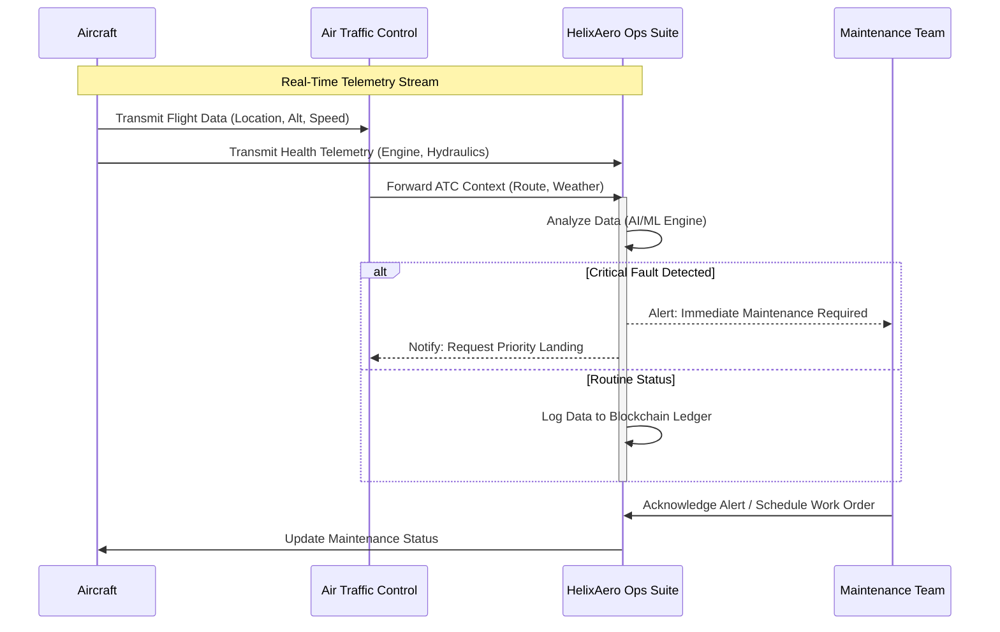
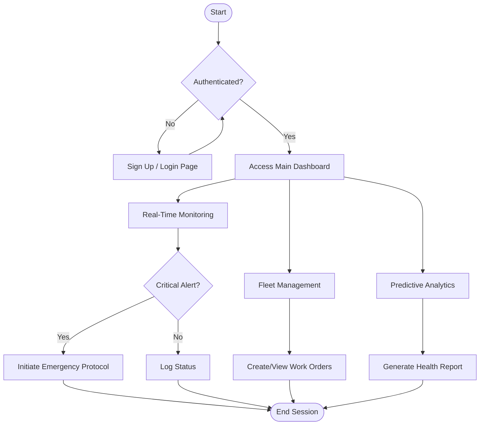

# HelixAero Ops Suite

> **Innovation in Flight**
>
> Bridging the critical gap between Avionic ATC and Maintenance Management Systems with real-time monitoring, predictive analytics, and comprehensive compliance tracking.


## 📋 Features

| Feature | Description | Key Benefit |
| :--- | :--- | :--- |
| **Real-Time Monitoring** | Live ATC data integration with aircraft telemetry and health monitoring. | Immediate situational awareness. |
| **Predictive Maintenance** | AI-powered analytics for proactive maintenance scheduling and fault detection. | Reduces downtime and costs. |
| **Compliance Tracking** | Automated regulatory compliance with blockchain-anchored audit trails. | Ensures adherence to DO-178C/ARINC 653. |
| **Fleet Management** | Comprehensive aircraft status, work orders, and inventory management. | Streamlined operations. |

## 🛠️ Tech Stack

| Category | Technology | Version |
| :--- | :--- | :--- |
| **Framework** | Next.js | 15.2.4 |
| **UI Library** | React | 19 |
| **Styling** | Tailwind CSS | 4.1.9 |
| **Icons** | Lucide React | 0.454.0 |
| **Charts** | Recharts | Latest |
| **Validation** | Zod | 3.25.76 |
| **Forms** | React Hook Form | 7.60.0 |

## 🔄 System Architecture

The following sequence diagram illustrates the high-level data flow between the Aircraft, ATC, and the HelixAero Ops Suite.



## 🗺️ User Workflow

This flowchart depicts the typical user journey for an Operations Manager using the suite.



## 🚀 Getting Started

### Prerequisites

- Node.js (v18 or higher)
- pnpm (recommended) or npm

### Installation

1.  Clone the repository:
    ```bash
    git clone https://github.com/your-org/helixaero-ops-suite.git
    ```
2.  Navigate to the project directory:
    ```bash
    cd helixaero-ops-suite
    ```
3.  Install dependencies:
    ```bash
    pnpm install
    ```

### Running Locally

Start the development server:

```bash
pnpm dev
```

Open [http://localhost:3000](http://localhost:3000) with your browser to see the result.

